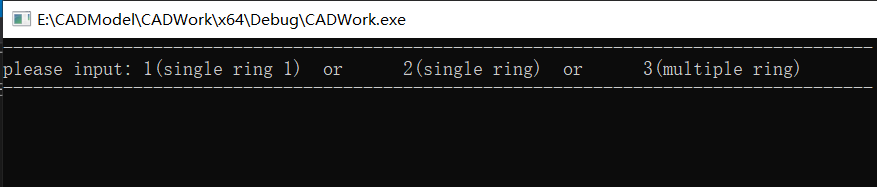
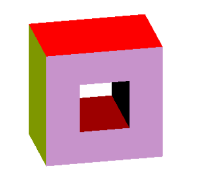
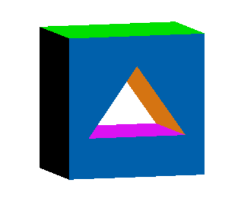
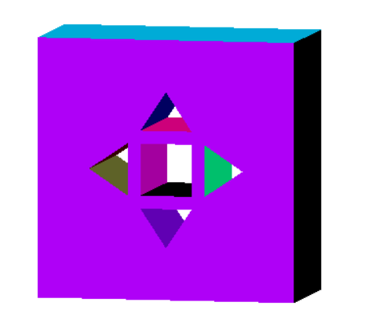

# 3D CAD Modeling Course

## Introduction

- Implemented 6 Euler operations and their corresponding inverse operations respectively, based on halfedge data structure;
- Implemented Sweep operation based on Euler Operations and generated solids rendered by OpenGL; 

## Configuration
  
- Environment: Windows VS2019
- Required third-party library:freeglut jsoncpp

## Usage

Run `CADWork.exe` and input a parameter as prompted

   

Display sample solids. 
What you can do to solids:
- Hold down the left mouse button to rotate object
- Press up, down, left and right keys to translate object
- Press "+", "-" keys to zoom in and out

## Example

- Solid with a through hole 

 
 

- Solids with multiple through holes

 
